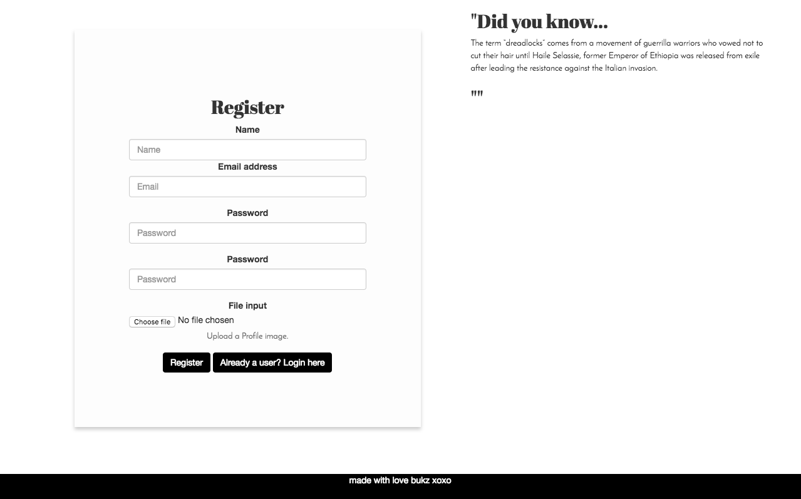
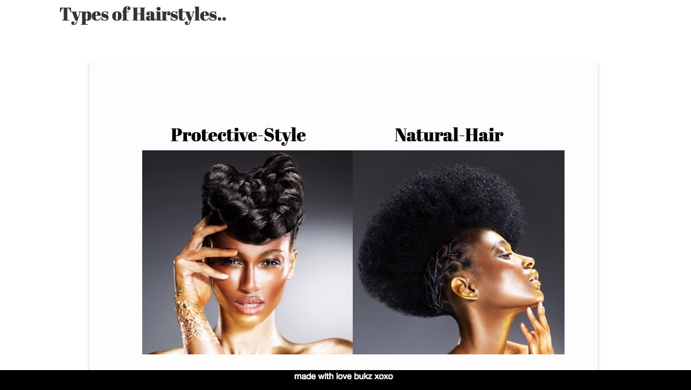
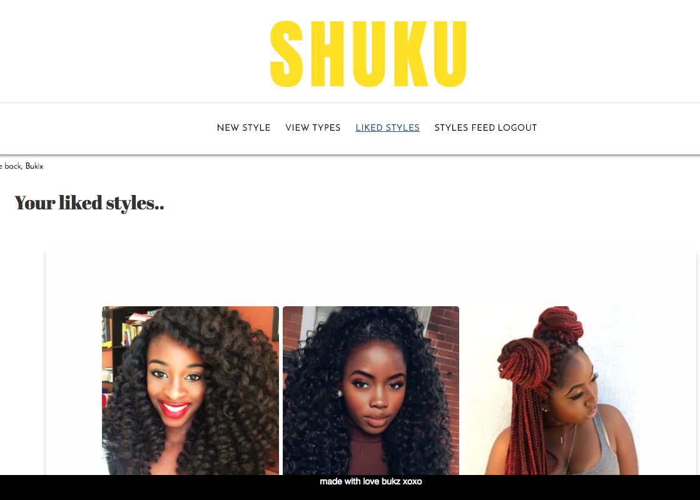
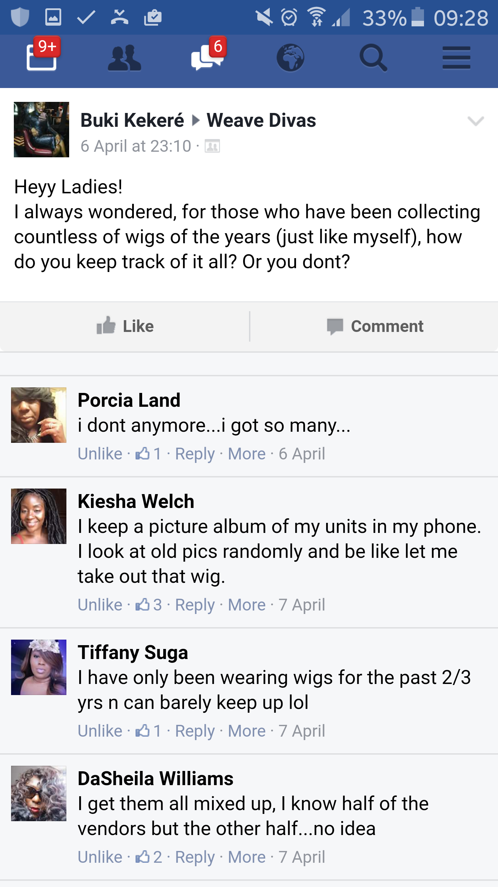
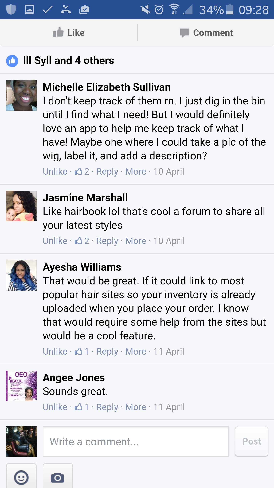
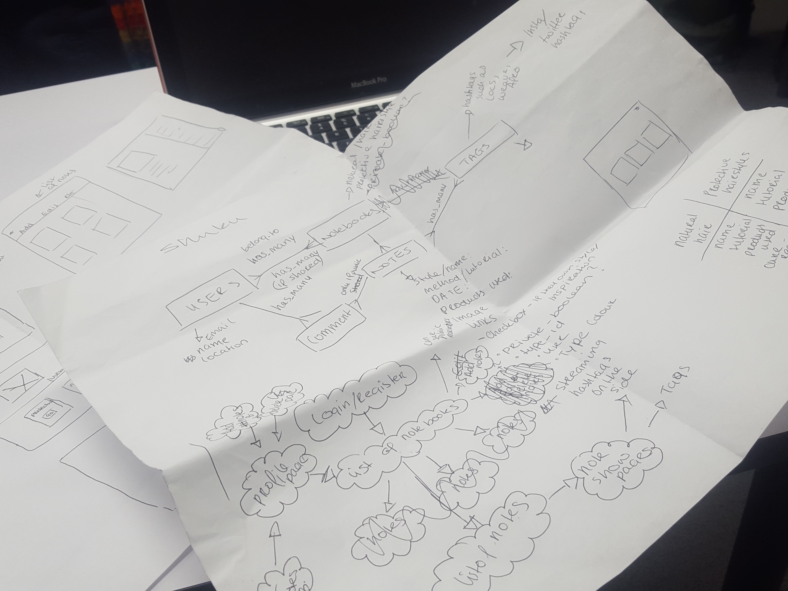
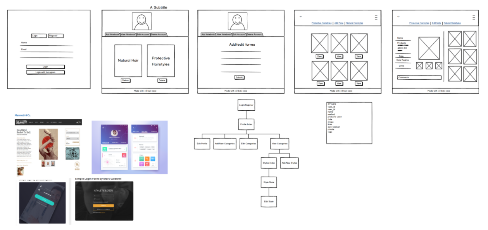

# What is SHUKU?

[View it here!](https://thawing-journey-31360.herokuapp.com/login "Here!")

I am really excited about how small ideas, combined technology shake up and disrupts industries in order to make life easier for us. That was something I really wanted to explore more in my final project.

### Approach / How it works

I wanted to create something that may not necessarily be a new invention but be something that would make my life easier for myself and others too.

My final Project is called ‘SHUKU’ and it is an app which acts as a database, to keep keeps track of all of your hair extensions and hairstyles.

It also has a social media aspect to by which you can follow and track hairstyles for inspiration.

‘SHUKU’ is a RESTful app with a rails backend and AngularJS front end. The database was produced using PostgreSQL. In terms of styling, I used a combination of Bootstrap, SAAS and CSS.

## Planning

I am very passionate about my hair and hair extensions and I felt sometimes really overwhelmed with the amount of extensions. I wanted to explore if anyone else shared the same issues so I joined hair groups on Facebook on posted questions. In response to my questions, a lot of women felt exactly the same way. That’s when I realise I could provide a solution to this need.

Once I established the problem, I used the information to plan out in detail the user story first on pen and paper then using Balsamiq.

I was inspired by procedure of creating notebooks and notes in Evernote, so I wanted to keep it similar. It was also very important to keep the whole layout and user experience as simple as possible as the whole point of the app was to help with organization. I didn’t want the user to get distracted by colours or pictures not related to the app.

I am very proud of the outcome as I feel that I have been able to provide a solution to a need. I will however revisit it and add either the Instagram or twitter API to provide a much better user experience for the user.
